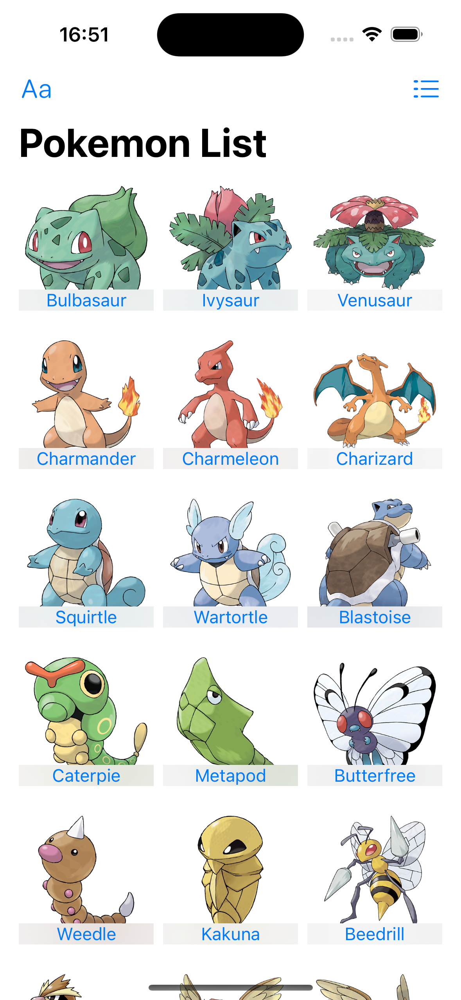
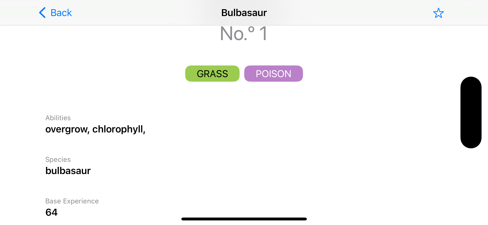

iOS application consuming POKEAPI, using SwiftUI, MVVM-C, Combine

# Architecture
MVVM-C + Combine architecture

## Data Access Layer

Data Access Layer includes `APIServiceTypeAPIRequestType` protocol and `APIRequestType` protocol to standardise the networking logic. They provide asynchronous APIs for networking. It pass data as a `Publisher` from `Combine` framework. 

## Business Logic Layer

Business Logic Layer includes `Services` and `ViewModels`. 

In the `Services` layer we have `PokemonAPIService` that receives requests to fetch pokemon data and sends data to a webhook.

`PokemonAPIService` comforms to `APIServiceType` protocol. This way gives the ability to use dependency injection to inject `MockPokemonAPIService` in `ViewModel` in unit tests.

`ViewModels` work between `Views` and `Services`, encapsulating business logic to the `Views`. 

 Also `ViewModels` request and subscrive to process whatever is passed from upstream publishers (`Services`)

## Presentation Layer

Presentation Layer is represented by `Views`.

Inside `Views` the `ViewModels` are marked as `@ObservedObject` such that SwiftUI is able to monitor `ViewModels` for updates and redraw the UI.

# Screens

The application works on iPhone and iPad devices, supporting portrait and landscape orientations. 

## Pokemon list

In this screen the user can view the pokemon list order by pokemon ID. The default layout consists in `List` with pokemon image, name and id.

It's also possible to display the pokemon information in a `Grid` layout, with pokemon image and corresponding name.

In both layouts it is also possible to order pokemon by `name` instead of the default order by `id`

## Pokemon details

Screen with pokemon details like `name`, `image`, `id` and `type`. Also, we had a list with different characteristics of the corresponding pokemon

